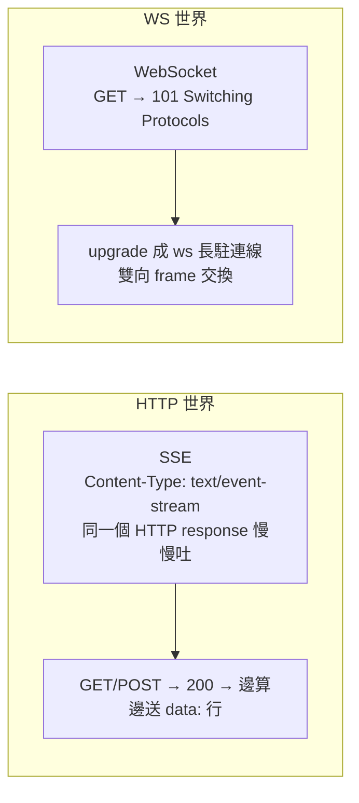

# 通訊協定 survey：SSE vs WebSocket（2026/08/10）

| 項目 | 內容 |
| --- | --- |
| 階段 | Phase 2/3（Agent + 聊天介面 MVP），M3 前置選型 |
| 關聯文件 | `docs/work/2026_0809-phase2_3_mvp.md`（§4.2 聊天介面決策、M3 里程碑） |
| 結論 | **採用 SSE**（FastAPI `StreamingResponse`），不採用 WebSocket |
| 紀錄日期 | 2026/08/10 |

---

## 1. SSE 是什麼

**SSE（Server-Sent Events）是「單向」的伺服器推送協定**：瀏覽器（或任何 HTTP client）建立一條普通 HTTP 連線後，伺服器可以在**同一個連線上持續不斷地推送事件**給客戶端，直到關閉。

### 1.1 運作原理

1. 客戶端發起請求，帶上 `Accept: text/event-stream`
2. 伺服器回傳 `Content-Type: text/event-stream`，**邊算邊送**，每次寫出 `data:` 開頭的事件，用空行分隔
3. 客戶端即時收到每個事件；連線保持開啟，斷線後瀏覽器 `EventSource` **自動重連**

```
HTTP/1.1 200 OK
Content-Type: text/event-stream
Cache-Control: no-cache

data: {"type": "token", "content": "你"}

data: {"type": "token", "content": "好"}

data: {"type": "done", "response": "你好", "sources": [...]}
```

### 1.2 本質

SSE 是「作弊的 HTTP」：伺服器只是不把 response 一次回完，而是掛著連線分批寫。中間所有 HTTP 基建（proxy、CDN、認證）**原樣適用**。

---

## 2. SSE vs WebSocket 核心差異總表

| 面向 | **SSE** | **WebSocket** |
| --- | --- | --- |
| 資料方向 | **單向**（伺服器 → 客戶端） | **雙向**（可同時互相收發） |
| 底層協定 | 純 **HTTP**（沿用 HTTP/1.1、HTTP/2） | 獨立協定（`ws://` / `wss://`），HTTP 僅做 101 握手 |
| 連線模型 | 每問一題一條短連線，答完即斷 | 長駐連線，建立後持續開啟 |
| 訊息格式 | 純文字、`data:` 行 + 空行分隔（強制 UTF-8） | 文字或**二進位**（frame-based） |
| 自動重連 | ✅ 內建（`EventSource`） | ❌ 自行實作 |
| 斷線續傳 | ✅ `Last-Event-ID` 補送遺漏事件 | ❌ 自行設計 |
| 併發連線數 | 瀏覽器限制（HTTP/1.1 約 6 條／域名） | 通常不受 6 條限制 |
| 代理 / 防火牆 | ✅ 就是 HTTP，穿透率最高 | ⚠️ proxy 閒置斷線、upgrade 可能被擋 |
| CORS | ✅ 標準 CORS 規則 | 握手階段同受 CORS 規範，較易踩坑 |
| 心跳 | 靠 HTTP 長連線本身 | 需自行 ping/pong 維持 |
| 後端實作複雜度 | ⭐ 低（FastAPI 一個 `StreamingResponse`） | 中（連線池、廣播、心跳） |
| 前端實作複雜度 | ⭐ 低（`EventSource` 或 `fetch` + `ReadableStream`） | 中（重連、狀態機） |
| 標準化 | W3C（HTML5 spec） | IETF RFC 6455 |
| 代表性使用 | LLM token 串流、股票報價、通知、log 輸出 | 聊天室、即時遊戲、協作編輯 |



---

## 3. 在「LLM 串流聊天」場景的關鍵比較

| 需求 | SSE | WebSocket | 誰贏 |
| --- | --- | --- | --- |
| 逐 token 即時輸出 | ✅ 天生適合 | ✅ 也適合 | 平手 |
| 中途中斷生成（停止鍵） | ⚠️ 只能斷開連線 | ✅ 同連線送 stop 指令 | **WS** |
| 同連線連續多輪問答 | ❌ 一問一連線（記憶靠 thread_id 帶回） | ✅ 同一連線連續問 | **WS** |
| 伺服器主動推訊息 | ✅ 可以 | ✅ 可以 | 平手 |
| 斷線重連 + 補送 | ✅ 內建 | ❌ 自幹 | **SSE** |
| 穿過公司 / 學校 proxy | ✅ 最穩 | ⚠️ 偶爾被擋或斷線 | **SSE** |
| 實作與除錯成本 | ⭐ 最低 | 中高 | **SSE** |
| 測試（curl 直接看） | ✅ `curl -N` 看到 `data:` 流 | ❌ curl 只能看握手 | **SSE** |

**一句話**：WebSocket 贏在「雙向互動 + 長駐連線」，SSE 贏在「簡單、可靠、穿透力強」。LLM 問答的本質是「一次問 → 一串答案」，是**單向突發流**，SSE 就是為此設計的。

---

## 4. 選型決策：採用 SSE（理由）

| # | 理由 | 對應本專案事實 |
| --- | --- | --- |
| 1 | 需求是「送一題 → 串流收完整回答」，無連線內雙向控制需求 | M3/M4a 驗收標準即為「curl 逐 token 串流 + 附來源」 |
| 2 | 多輪記憶已在後端用 `thread_id`（`InMemorySaver`）解決，**不依賴連線狀態** | M2 已完成；「多輪 ≠ 需要 WebSocket」 |
| 3 | demo 環境（自有網站 / 學校網路）穿透性優先 | doc §7 風險表已列 proxy/CSP 為風險；SSE 即 HTTP 風險最低 |
| 4 | 驗收與除錯成本最低：`curl -N` 直接看 `data:` 流 | doc §8 M3 驗收標準 |
| 5 | 後端零新概念：FastAPI `StreamingResponse` 天生支援 | M0 已安裝 `fastapi` / `uvicorn` |
| 6 | 中途中斷可用前端 `AbortController`（斷連線）達到同等效果 | 無需 WebSocket 的 stop frame |

> **常見誤解澄清**：串流 ≠ WebSocket。ChatGPT / Gemini / Claude 網頁端在純 HTTP 情境下也是走 SSE（或類似 chunked response）。SSE 是標準 HTTP，`StreamingResponse` 即為其後端實作。

---

## 5. 何時才值得改用 / 併用 WebSocket（紀錄在案）

- 需要「同連線內取消生成」的細緻控制（目前斷連線即可達成）
- 需要伺服器主動推「建置進度」、「新來源入庫通知」給已開啟的 widget
- 同一頁面大量即時互動（非本專案場景）
- 混合方案（聊天走 SSE、通知走 WebSocket）為業界常見組合，但**目前不需要**——最小實證原則：只引入解決當下問題的技術

---

## 6. 對 M3 的落地結論

- M3 維持 **FastAPI + SSE**（`POST /api/chat` → `StreamingResponse`，事件協定 `token` / `done` / `error`）
- 前端（M4a）用 `fetch` + `ReadableStream` 解析（POST 自訂 JSON payload 不受 `EventSource` 僅 GET 限制）
- 本 survey 為選型紀錄，不做其他變更
