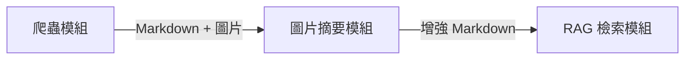

# 2026.06.29 簡報大綱

> 日期：2026.06.29
>
> 範圍：整體專案規劃 · Phase 1 進度報告

---

## 封面頁（Slide 1）

> 引用來源：[docs/project.md](../../project.md)

- 專案名稱：**Website Copilot**
- 副標題：預建知識庫 × 自主操作代理 — 與特定網站深度整合的 AI 助手
- 標示：專案規劃 & Phase 1 進度報告 / 2026.06.29
- 報告人：薛耀智

---

## 議程（Slide 2）

1. 專案定位
2. 專案開發
3. Phase 1：資訊檢索 進度
4. RAG 成效評估
5. 未來規劃

---

## 第一部分：專案定位（Slide 3–5）

> 引用來源：[docs/survey/pain_point.md](../../survey/pain_point.md) · [docs/survey/competitors.md](../../survey/competitors.md) · [docs/survey/technology.md](../../survey/technology.md)

### 1.1 專案背景（Slide 3）

#### 為什麼需要 Website Copilot？

* 網站資訊龐雜，使用者難以快速找到所需資訊
* 網站實際操作輔助不足，使用者自行完成任務效率低

### 1.2 競品分析（Slide 4）

> 引用來源：[docs/survey/competitors.md](../../survey/competitors.md)

- **AI 客服（Zendesk AI · Intercom Fin AI）**：
  - **簡介**：基於 LLM 與企業知識庫進行問答與來源追溯，部分可串接 API 執行簡單任務
  - **限制**：採唯讀策略，無法實際操作網站介面或導航，僅止於文字說明
- **AI Web Agent（Browser Use · Skyvern · LaVague）**：
  - **簡介**：開源網頁自動化框架，可自主操作瀏覽器執行表單填寫、跨頁面任務
  - **限制**：以即時感知為主，缺乏網站事先理解與內建工作階段管理，每次互動皆需處理大量 DOM 或頁面截圖
- **AI 瀏覽器（Gemini in Chrome · Edge Copilot · Perplexity Comet）**：
  - **簡介**：內建瀏覽器 AI 助理與工作階段管理，具備跨分頁理解與背景自動化能力
  - **限制**：通用型設計，未針對特定網站深度整合，需反覆處理完整 DOM 或頁面截圖，延遲與成本較高

### 1.3 痛點分析（Slide 5）

> 引用來源：[docs/survey/pain_point.md](../../survey/pain_point.md)

- 痛點①：僅止口頭說明 — 解決問題只能提供文字回覆，無法實際協助操作
- 痛點②：缺乏事先理解 — 執行任務仰賴即時感知，沒有預先理解網站
- 痛點③：不支援長期互動 — 提供協助侷限在短時間互動，長時間互動穩定性低

---

## 第二部分：專案開發（Slide 6–8）

> 引用來源：[docs/survey/technology.md](../../survey/technology.md) · [docs/code/phase1.md](../../code/phase1.md)

### 2.1 專案目標（Slide 6）

> 引用來源：[docs/survey/technology.md](../../survey/technology.md)

- **預建網站知識庫** — 從局部感知進化至全域掌握
- **賦予網站操作能力** — 從被動問答進化至主動執行
- **導入對話狀態管理** — 從單次協助進化至長期互動

### 2.2 技術分析（Slide 7）

> 引用來源：[docs/survey/technology.md](../../survey/technology.md)

- 全站知識索引&檢索（事先建立全站知識索引，查詢時語意檢索）
- 網站操作介面（使用 MCP 統一整合網站操作工具）
- 代理自動化（將任務拆解執行並動態除錯）
- 對話狀態管理（透過記憶管理與相似度過濾維持對話脈絡）

### 2.3 開發規劃（Slide 8）

> 引用來源：[docs/project.md](../../project.md) · [docs/survey/technology.md](../../survey/technology.md) · [docs/code/phase1.md](../../code/phase1.md)

| 階段 | 目標 | 狀態 |
|------|------|------|
| Phase 1：資訊檢索 | 網站知識庫 + 語義檢索 | **📍 進行中** |
| Phase 2：網站導航 | Agent 推理核心 + Web 操作 MCP | 未來規劃 |
| Phase 3：專責代理 | 前端輕量化感知層 + 嵌入式介面 | 未來規劃 |

---

## 第三部分：Phase 1：資訊檢索 進度（Slide 9–13）

> 引用來源：[docs/code/phase1.md](../../code/phase1.md) · [docs/progress_report/2026_0518.md](../progress_report/2026_0518.md)

### 3.1 模組工作流（Slide 9）

> 引用來源：[docs/code/modules/data_collect.md](../code/modules/data_collect.md) · [docs/code/modules/data_preprocess.md](../code/modules/data_preprocess.md) · [docs/code/modules/data_retrieve.md](../code/modules/data_retrieve.md) · [docs/code/runs/workflow.md](../code/runs/workflow.md)

- **三階段 pipeline 依序串接**：爬取網站 → 摘要圖片 → 建置向量索引
- **每階段輸出即下一階段輸入**，可獨立執行單一模組，亦可全流程自動串接

### 3.2 模組一：資料獲取 — Website Crawler（Slide 10）

> 引用來源：[docs/code/modules/data_collect.md](../code/modules/data_collect.md) · [docs/progress_report/2026_0518.md](../progress_report/2026_0518.md)

- 非同步爬取，限制網域／深度／頁數
- 網頁轉 Markdown，移除 Navbar、Footer 等雜訊
- 平行處理、去重、統計記錄
- ✅ 已完成

### 3.3 模組二：資料前處理 — Image Summarizer（Slide 11）

> 引用來源：[docs/code/modules/data_preprocess.md](../code/modules/data_preprocess.md) · [docs/progress_report/2026_0518.md](../progress_report/2026_0518.md)

- VLM 圖片摘要，結果寫回 Markdown
- Prompt 迭代：prompt-v1 → v2 → v3
- 下載快取、自動重試、指數退避
- 多模型比較：gemini-2.5-flash-lite / gemini-3-flash / gemini-3-pro
- ✅ 已完成

### 3.4 模組三：資料查詢 — RAG 當前進度（Slide 12）

> 引用來源：[docs/code/modules/data_retrieve.md](../code/modules/data_retrieve.md) · [docs/progress_report/2026_0518.md](../progress_report/2026_0518.md)

- 技術棧：LlamaIndex · OpenAI `text-embedding-3-small` · Qdrant 本地持久化
- 向量嵌入與索引建立（支援增量載入既有儲存）
- 查詢引擎：Gemini 生成回答，`SimilarityPostprocessor(cutoff=0.5)`

### 3.5 網頁資料處理（Slide 13）

> 引用來源：[docs/code/modules/data_collect.md](../code/modules/data_collect.md) · [docs/code/modules/data_retrieve.md](../code/modules/data_retrieve.md)

- **HTML 轉 Markdown**：爬取後將 HTML 轉為 Markdown，移除 Navbar、Footer 等雜訊，保留純淨內文與圖片連結供後續處理
- **空標題合併**：`MarkdownHeadingMergeParser` 將孤立標題節點併入下一個有實質內容的節點，避免切出無效 Chunk
- **Metadata 抽離**：圖片、來源網址等非文字資訊抽離至 Metadata，避免向量空間汙染，同時保留未來 Citation 所需的來源追溯

---

## 第四部分：RAG 成效評估（Slide 14–16）

### 4.1 評估設置（Slide 14）

> 實驗進行中，資料待補

### 4.2 評估方法（Slide 15）

> 實驗進行中，資料待補

### 4.3 評估結果（Slide 16）

> 實驗進行中，資料待補

---

## 第五部分：未來規劃（Slide 17–19）

> 引用來源：[docs/project.md](../../project.md) · [docs/code/phase1.md](../../code/phase1.md) · [docs/survey/technology.md](../../survey/technology.md) · [docs/progress_report/2026_0518.md](../progress_report/2026_0518.md)

### 5.1 Phase 1 收尾（Slide 17）

> 引用來源：[docs/code/modules/data_retrieve.md](../code/modules/data_retrieve.md) · [docs/progress_report/2026_0518.md](../progress_report/2026_0518.md) · [docs/code/phase1.md](../../code/phase1.md)

- **檢索品質調校與驗證**：Chunking 策略最佳化 · Dense / Hybrid 檢索比較 · LlamaIndex / Ragas 成效評估
- **基本 AI 代理**：意圖識別與查詢轉換，支援自然語言問答
- **前端聊天介面**：聊天視窗元件開發，串接 RAG 後端 API

### 5.2 Phase 2 網站導航（Slide 18）

> 引用來源：[docs/project.md](../../project.md)

- AI 代理理解使用者自然語言指令
- 直接控制網站進行頁面跳轉、資料篩選與功能切換

### 5.3 Phase 3 專責代理（Slide 18）

> 引用來源：[docs/project.md](../../project.md)

- AI 代理整合使用者身分權限與歷史數據
- 自動完成表單代填、預約等個人化操作

---

## 結語（Slide 19-20）

### 已完成 （Slide 19）

- 網站爬蟲模組 — 非同步爬取、HTML 轉 Markdown、雜訊移除
- 圖片摘要模組 — VLM 圖片摘要、Prompt 迭代、多模型比較

### 進行中（Slide 19）

- RAG 查詢引擎整合與成效評估
- 基本 AI 代理與前端聊天介面開發

### 下一步 （Slide 20）

- **Phase 1 收尾**：檢索品質調校 · Agent 與介面建置
- **Phase 2 啟動**：網站導航 · 頁面跳轉與功能操作