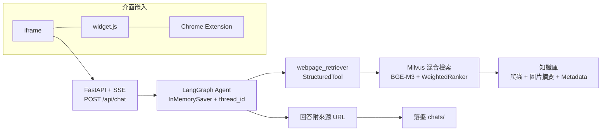

<!-- _class: lead -->

# Website Copilot

Phase 2/3 MVP：AI Agent × 聊天介面

<small>專案進度報告 · 2026.08.12</small>
<small>薛耀智</small>

---

## 大綱

1. **背景與目標**
   — 承接上次進度 · 端到端 MVP

2. **Phase 2：AI Agent**
   — 選型 · LangGraph 問答 · 多輪記憶 · 串流

3. **Phase 3：聊天介面**
   — 選型 · FastAPI SSE · 三種嵌入表面 · Chrome Extension

4. **端到端成果**
   — 架構總覽 · 驗證指標達成

5. **未來規劃**
   — 對話累積 · 成本優化 · MCP Server

---

## 背景與目標

* **上次進度**：RAG Retriever Tool 已包裝為 `StructuredTool`，**Agent 整合是下一步**。
* **MVP 目標**：RAG 工具 → Agent → 可嵌入網站的聊天介面

---

<!-- _class: lead -->

# Phase 2：AI Agent

---

## 選型：Agent 框架

### 採用 **LangGraph**

| 方案 | 取捨 |
|------|------|
| **A. LangGraph** ✅ | `StructuredTool` **直接支援**、快速建立 Agent、內建串流 / 記憶 |
| B. LlamaIndex AgentWorkflow | Tool 介面需轉接，偏離路線 |
| C. 手工 ReAct 迴圈 | 自建 tool_calls 解析 / 重試 / 串流，複雜度高 |

---

## Agent 設計

- **工具整合**：LangGraph `create_agent` 包裝 `webpage_retriever`，LLM 自主決定檢索時機與參數（`query` / `filter_dict`）
- **串流輸出**：`astream` 逐 token 顯示（`--run.stream`），回答即時呈現
- **回覆機制**：回答附檢索來源 URL，對話紀錄儲存至 `chats/<ts>/agent/`
- **多輪記憶**：`InMemorySaver` + `thread_id`，同 thread 連續追問記得上下文

---

<!-- _class: lead -->

# Phase 3：聊天介面

---

## 選型：聊天介面

### 採用 **FastAPI + SSE + 單頁前端**

| 方案 | 取捨 |
|------|------|
| **A. FastAPI + SSE** ✅ | 輕量可控，方便 Phase 3 正式版移植 |
| B. Chainlit | 現成 UI 但依賴重、客製受限 |
| C. Gradio / D. LangGraph Platform | 聊天體驗一般 / 對最小實證過重 |

---

## API設計

- **SSE 事件協定**：`token`（逐 token 文本）/ `done`（完整回應 + thread_id 續接多輪）/ `error`（錯誤訊息）
- **Session 管理**：thread_id 由 server 自動產生（`auto-{uuid}`），前端可重新呼叫持續 session
- **資源生命週期**：agent 和工具於 server 啟動時建一次，並在關閉時釋放

---

## 網頁嵌入設計

- **iframe 嵌入**：一行 `<iframe>` 嵌入完整聊天頁（`http://localhost:8000/static/chat.html`）
- **script widget 嵌入**：一行 `<script>` 在任何頁面右下角浮動 💬 對話框（`data-endpoint` 指定後端）
- **Chrome 擴充功能**：content script 注入 widget 到任何網站，由 background worker 代理 fetch 後端 SSE（繞過網頁 CORS / CSP）

---

## 端到端架構

---

## MVP 成果總結

1. **檢索**：網站知識庫 + 混合檢索，組合為檢索工具
2. **推理**：LangGraph Agent 補上多輪記憶與串流，會檢索、附來源
3. **介面**：FastAPI SSE + iframe/widget/Chrome Extension 可以嵌入任何網站

---

## 未來規劃

**Phase 2 進階**

- Agent 工具包裝為 **MCP Server**
- 工具調用成本優化

**前台 Copilot 功能**

- 進階資料檢索 · Context / Memory Management
- 使用者個人化學習 · COT / Tree of Thoughts

**後台 Copilot 功能**

- 功能優化 · 錯誤處理
