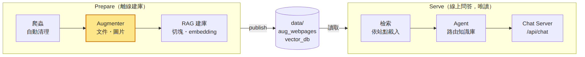
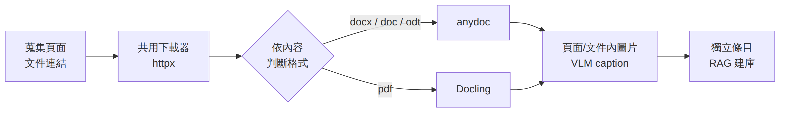

<!-- _class: lead -->

# Website Copilot

讀取網站文件：docx／doc／odt／pdf 進入知識庫

<small>專案進度報告 · 2026.10.05</small>
<small>薛耀智</small>

---

## 大綱

1. **背景與目標**
   — 承接上次進度 · 擴增網頁讀取內容

2. **問題與 Survey**
   — 爬蟲未涵蓋文件 · 現有方案實測

3. **設計與實作**
   — Augmenter 流程 · 關鍵設計取捨

4. **成果與後續規劃**
   — 效果 · 端到端成果 · 後續規劃

---

## 背景與目標

* **上次進度**：完成端到端流程，添加新網站**零人工清理**（LLM 自動產生 `exclude_words`）
* **核心問題**：網站上的重要資訊（修業辦法、申請表單、公告）常放在文件檔，目前知識庫讀不到
* **本次目標**：**擴增網頁讀取內容**，讓 docx／doc／odt／pdf 文件也能被檢索

---

<!-- _class: lead -->

# 問題與 Survey

---

## 現況：爬蟲未涵蓋文件

| 去向 | 數量 | 原因 |
|------|:----:|------|
| 被訪問但丟棄 | 45 | 瀏覽器導航觸發下載，記為 `no markdown` |
| 未被訪問 | 41 | 只出現在深度 2 頁面，受 `max_depth` 限制 |
| 被網域過濾 | 5 | 不在 `allowed_domains` |

* ncucsie 共 **91 個文件連結**（pdf、odt、doc、docx；25 個為無副檔名的下載 API）
* 資訊價值最高的是修業／選課／畢業辦法（pdf），其次為表單與公告

---

## Survey：不採用 crawl4ai 內建模組

| 方案 | 實測問題 |
|------|---------|
| 瀏覽器下載 `accept_downloads=True` | Chromnium 卡在`Download is starting`。 下載清單掛到錯誤的結果，**無法找出「URL → 檔案」對應**。|
| PDF 處理器 `PDFCrawlerStrategy` | **只支援 PDF**：odt 直接報 `invalid pdf header`。 下載到暫存檔後即刪除，**不保留原檔**。 |

* **結論**：先爬 HTML、收集文件 URL、再另行處理（與官方維護者建議一致）
* 因此自寫共用下載器（httpx），文件解析獨立於爬蟲

---

<!-- _class: lead -->

# 設計與實作

---

## 專案架構：Prepare → Serve

* **Prepare** 離線建庫並 publish；**Serve** 只讀 `data/`，兩者互不依賴
* 本次擴充的是 **Augmenter**（標示處）：加入文件讀取

---

## 流程：Augmenter

* 文件流程與圖片摘要同構，故將 image summarizer 擴充為通用 **Augmenter**
* 文件成為獨立條目，頁面圖片與文件內圖片共用同一套過濾與並行機制

---

## 設計取捨

| 設計 | 選擇 |
|------|------|
| 格式判斷 | 依內容而非 URL：magic bytes → Content-Disposition → Content-Type → 副檔名 |
| 內容去重 | 同一文件被多頁引用只處理一次，其他 URL 記為 `alternate_urls` |
| 文件內圖片 | 以 2 倍解析度裁切；佔位符定位後交 VLM 產生 caption；與頁面圖共用過濾、去重、並行上限 |
| 來源追溯 | `source_pages` 於切塊後才寫入 node（避免 metadata 超過 chunk size） |

---

<!-- _class: lead -->

# 成果與後續規劃

---

## Augmentation 成效（ncucsie）

| 指標 | 結果 | 說明 |
|------|:----:|------|
| 解析成功文件 | **71 份** | PDF 38、odt 19、doc 9、docx 5 |
| 向量庫 nodes | 977 → 1271 → **1643** | docx／doc／odt → 加入 PDF → 加入文件內圖片說明 |
| 檢索問題集 | **19 / 19** | 表單 10、PDF 6、答案只在圖片說明 3|

* 效能優化：圖片跨頁去重、共用並行上限，nculab 圖片摘要耗時 194.5 → **27.3 秒**

---

## 端到端成果

| 站點 | 耗時 | 花費 |
|------|:----:|:----:|
| nculab | 93 秒 | $0.0906 |
| ncucsie（217 筆，含 71 份文件） | 393 秒 | $0.3629 |

1. 爬蟲不再丟棄文件，改由獨立流程收集與下載
2. Augmenter 統一處理文件與圖片
3. docx／doc／odt／pdf 皆可檢索，含文件內圖片說明

---

## 後續規劃

1. **網站知識庫版本控制**
2. **加強知識庫檢索機制**（KG、Graph RAG…）
3. **維護網站知識庫的 agent**（後台 agent）
