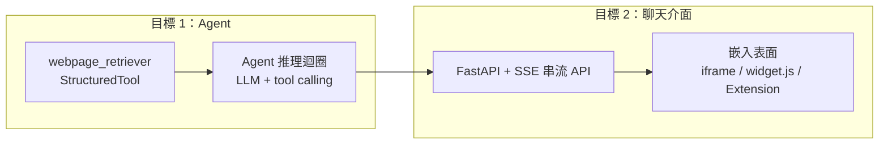

# Phase 2/3 最小實證規劃 (2026/08/010)

## 1. 摘要

| 日期  | 階段                                                                                                                  |
| ----- | --------------------------------------------------------------------------------------------------------------------- |
| 08/09 | 盤點：確認 Phase 1 功能面完成（RAG 已包裝為 StructuredTool），環境盤點（langgraph 未安裝、langchain-core 版本相容性） |
| 08/09 | 選型：Agent 框架、聊天介面、串流、部署、多輪記憶 5 項決策確認                                                         |
| 08/09 | 規劃：目標架構、里程碑（M0~M5）、M4 嵌入方案（iframe / script widget / Chrome Extension）確認                         |
| --    | 實作：待開始（見 §9 待辦事項）                                                                                       |

**結論**：以「最簡單的實證」打通價值鏈 —— **RAG 工具 → Agent → 可嵌入網站的聊天介面**。Phase 1 已提供 `webpage_retriever`（LangChain `StructuredTool`），本規劃決定以 **LangGraph `create_agent`** 包裝為 Agent（與 `2026_0721-RAG_Upgrade.md` §四 規劃一致），以 **FastAPI + SSE + 單頁前端** 提供聊天介面，並以 **iframe / script widget / Chrome Extension** 三種表面嵌入網站。分 M0~M5 六個里程碑漸進實作，先 CLI 驗證 Agent、再接介面。

---

## 2. 背景與動機（現狀問題）

| 面向             | 現況                                                                                                                       | 影響                                                              |
| ---------------- | -------------------------------------------------------------------------------------------------------------------------- | ----------------------------------------------------------------- |
| Phase 1 功能面   | 爬蟲、圖片摘要、混合檢索（Milvus + WeightedRanker）、Metadata Filter、RAG Retriever Tool、查詢引擎與評估、結果落盤皆已完成 | 具備完整的知識庫與檢索能力                                        |
| 與下游互動       | RAG 已包裝為 LangChain`StructuredTool`（`src/app/tools/webpage_retriever.py`），支援動態 filter_dict / top_k           | Agent 可直接呼叫，零轉接                                          |
| 尚未驗證的價值   | 「使用者 → Agent → RAG 檢索 → 回答」的端到端體驗尚未有任何實證                                                          | 進入 Phase 2（AI Agent）/ Phase 3（介面）前需最小可行性證明       |
| Agent 依賴缺口   | `langgraph`、`langchain`（本體）未安裝；僅有 `langchain-core 1.3.2` + `litellm` + `llama-index`                  | `2026_0721-RAG_Upgrade.md` 的 `create_agent` 範例目前無法執行 |
| 聊天介面依賴缺口 | `fastapi` / `uvicorn` 未安裝；無任何 Web 層                                                                            | Phase 3 無起點                                                    |

---

## 3. 環境盤點（已驗證事實）

| 項目                       | 狀態       | 備註                                                          |
| -------------------------- | ---------- | ------------------------------------------------------------- |
| `langchain-core`         | ✅ 1.3.2   | `StructuredTool` 可用                                       |
| `langgraph`              | ❌ 未安裝  | `langchain.agents.create_agent` 不可用                      |
| `langchain`（本體）      | ❌ 未安裝  | 僅有`langchain-classic 1.0.5`                               |
| `litellm`                | ✅ 1.83.14 | RAG config 的 query LLM 通道                                  |
| `llama-index`            | ✅ 0.14.21 | Phase 1 既有生態                                              |
| `fastapi` / `uvicorn`  | ❌ 未安裝  | M3 起需要                                                     |
| `webpage_retriever` tool | ✅ 可用    | name=`webpage_retriever`；`tool.rag.close()` 由呼叫者釋放 |

### 3.1 版本相容性風險（重要）

- `langgraph` 最新 1.2.x 要求 **`langchain-core>=1.4.7,<2`**，現有 **1.3.2 需升級**（`uv add` 時自動處理）。
- 影響面：Phase 1 的 `webpage_retriever.py` 僅用 `StructuredTool`（1.x 穩定 API），**預期無破壞**，但 M0 必須先跑回歸驗證。

---

## 4. 決策過程

### 4.1 目標 1：Agent 框架

| 方案                                    | 新增依賴      | 複雜度                                                             | 與既有規劃契合度                                    | 結果             |
| --------------------------------------- | ------------- | ------------------------------------------------------------------ | --------------------------------------------------- | ---------------- |
| **A. LangGraph `create_agent`** | `langgraph` | ⭐ 最低——一行建 agent，內建 tool loop / streaming / checkpointer | ✅ 極高——`2026_0721-RAG_Upgrade.md` §四 已指定 | ✅**採用** |
| B. LlamaIndex AgentWorkflow             | 0~1           | 中——tool 介面需轉接                                              | ⚠️ 低                                             | 未採用           |
| C. 手工 ReAct loop（litellm）           | 0             | 高——自建 tool_calls 解析、重試、串流                             | ❌ 偏離路線                                         | 未採用           |

採用理由：

1. 文件（07/21）已明確規劃「LangGraph 整合範例（`create_agent`，新版推薦）」——是預定方向而非新引入。
2. `StructuredTool` 可直接傳入 `create_agent`，**零轉接**；官方 Agentic RAG 範例即此模式。
3. 內建 streaming 與 `MemorySaver` checkpointer，目標 2 與多輪對話一次到位。

### 4.2 目標 2：聊天介面

| 方案                                  | 新增依賴                 | 嵌入方式                    | 優點                                   | 結果                       |
| ------------------------------------- | ------------------------ | --------------------------- | -------------------------------------- | -------------------------- |
| **A. FastAPI + SSE + 單頁前端** | `fastapi`、`uvicorn` | iframe / script / extension | 輕量、完全掌控、Phase 3 正式版無痛延伸 | ✅**採用**           |
| B. Chainlit                           | `chainlit`             | iframe                      | 現成對話 UI                            | 未採用（依賴重、客製受限） |
| C. Gradio                             | `gradio`               | iframe                      | 最快原型                               | 未採用（聊天體驗一般）     |
| D. LangGraph Platform                 | 平台                     | 官方 embed                  | 部署/持久化全套                        | 未採用（對最小實證過重）   |

### 4.3 使用者確認決策總覽（2026/08/09）

| 面向               | 決策                                                          | 理由                                                 |
| ------------------ | ------------------------------------------------------------- | ---------------------------------------------------- |
| Agent 框架         | LangGraph`create_agent`                                     | 與既有規劃一致、零轉接、內建串流/記憶                |
| 聊天介面           | FastAPI + SSE + 單頁前端                                      | 輕量、可控、Phase 3 API 串接的雛形                   |
| 串流               | 需要（token-by-token）                                        | 體驗較佳                                             |
| 多輪記憶           | `MemorySaver` + `thread_id`                               | 成本低、session 隔離                                 |
| Agent LLM          | 沿用 RAG config 的`query_llm_name`（gemini-3.1-flash-lite） | 零新設定；若 tool calling 不穩可換`gemini-3-flash` |
| 對話落盤           | 沿用 RunManager 落盤至`runs/`                               | 可復現、符合專案慣例                                 |
| 來源顯示           | 回答附檢索來源 URL                                            | 證明 RAG 價值                                        |
| 部署               | 本機 demo（localhost）                                        | 最小實證範圍                                         |
| M4 嵌入範圍        | 自有網站即可（iframe + script widget 為核心）                 | 已確認                                               |
| Chrome Extension   | 本機開發模式（load unpacked）、不上架                         | 加分展示                                             |
| Extension API 呼叫 | background service worker 代理 fetch                          | 繞過網頁 CORS/CSP 限制（標準做法）                   |

---

## 5. 目標架構

### 5.1 端到端流程



### 5.2 建議檔案結構（新增）

```text
src/
├── app/
│   ├── agent/                      # 新增：Agent 層
│   │   ├── agent.py                # create_agent 封裝（綁 tool、MemorySaver、來源擷取）
│   │   └── agent_cli.py            # CLI 入口：uv run python src/agent_cli.py "問題"
│   └── server/                     # 新增：聊天服務層
│       ├── app.py                  # FastAPI：GET /chat（頁面）、POST /chat（SSE）、CORS
│       ├── static/
│       │   ├── chat.html           # iframe 版聊天頁
│       │   └── widget.js           # 浮動按鈕 + 對話框 widget（script 嵌入用）
│       └── demo.html               # 展示頁：示範三種嵌入方式
└── extension/                      # M4b（加分項，可後做）
    ├── manifest.json               # MV3：host_permissions + content_scripts
    ├── content.js                  # 注入浮動 widget 到任何網頁 DOM
    └── background.js               # 代理 API 呼叫（繞過 CORS / mixed content）
```

### 5.3 嵌入方式（三表面共用同一後端與 widget）

| 方式                | 顯示範圍             | 使用者安裝成本 | 實作成本 | 用途                            |
| ------------------- | -------------------- | -------------- | -------- | ------------------------------- |
| iframe embed        | 自有網頁             | 零             | ⭐ 最低  | 自有網站 demo、Phase 3 正式嵌入 |
| `<script>` widget | 自有網站任何頁面     | 零             | 低       | 一行`<script>` 即用           |
| Chrome Extension    | 任何網站（即時浮出） | 需安裝         | 中       | 加分展示                        |

```html
<!-- ① iframe -->
<iframe src="http://localhost:8000/chat" width="380" height="560"></iframe>

<!-- ② script widget（自有網站任何頁面） -->
<script src="http://localhost:8000/widget.js" data-endpoint="http://localhost:8000"></script>

<!-- ③ Chrome Extension：content.js 把 widget 注入任何網站 DOM -->
```

後端配套：**CORS middleware**（允許 localhost 與自有網站來源）+ **static 檔服務**（widget.js）。

---

## 6. 里程碑計畫

| 里程碑                         | 內容                                                                                       | 驗收標準                                                           |
| ------------------------------ | ------------------------------------------------------------------------------------------ | ------------------------------------------------------------------ |
| **M0 依賴升級**          | `uv add langgraph fastapi uvicorn`（→ langchain-core ≥1.4.7）+ 回歸測試                | `uv run pytest` 全過（4 passed）；RAG smoke 正常                 |
| **M1 Agent CLI**         | `agent.py` + `agent_cli.py`；agent 呼叫 retriever 工具、回答附來源；對話落盤 `runs/` | CLI 問「實驗室成員有哪些人？」→ 自動檢索 → 附來源回答            |
| **M2 多輪 + 串流**       | 加`MemorySaver`、`astream` 串流介面                                                    | 連續追問記得上下文；stream 逐 token 輸出                           |
| **M3 聊天 API**          | FastAPI + SSE endpoint                                                                     | `curl -N` 可看到串流                                             |
| **M4a iframe + widget**  | `chat.html` + `widget.js` + `demo.html`（CORS、static）                              | 自有網頁加一行`<script>` → 右下角對話按鈕 → 串流/多輪/來源正常 |
| **M4b Chrome Extension** | manifest + content script + background 代理（本機開發模式）                                | 載入後在任何網站浮出 widget 並可對話                               |
| **M5 收斂**              | 測試、config 落盤、`docs/work/` 記錄、README                                             | 驗證指標齊全、CI 通過                                              |

> 實作順序：M0 → M1 → M2 → M3 → M4a → M4b → M5（使用者確認：先 CLI 驗證 Agent，再接介面）。

---

## 7. 風險與緩解

| 風險                                                | 等級 | 緩解                                                                                                                                           |
| --------------------------------------------------- | ---- | ---------------------------------------------------------------------------------------------------------------------------------------------- |
| langchain-core 升級（1.3.2 → ≥1.4.7）影響 Phase 1 | 中   | M0 先回歸測試；`StructuredTool` 為穩定 API，預期無破壞                                                                                       |
| `gemini-3.1-flash-lite` 工具呼叫能力不穩          | 低   | Agent 的 model 與 RAG config 解耦，可換`gemini-3-flash`                                                                                      |
| SSE 與 uvicorn 併發（本機多人同時用）               | 低   | demo 階段可接受；正式版再上 Redis/queue                                                                                                        |
| Extension 撞網站 CSP / mixed content                | 低   | 統一走 background 代理（extension origin 不受網頁 CORS 限制）；localhost 為 trustworthy origin，https 網站呼叫本機 API 不受 mixed content 阻擋 |
| `tool.rag` 資源生命週期（Agent 常駐）             | 低   | 沿用既有約定：呼叫者結束後`tool.rag.close()`；server 啟動時建一次、關閉時釋放                                                                |

---

## 8. 驗證指標

- **M1**：CLI 一問一答，回答附來源 URL，對話記錄落入 `chats/<ts>/agent/`。
- **M2**：同一個 thread 連續追問（如「那 2024 年後的論文呢？」）記得上下文。
- **M3**：SSE 逐 token 串流。
- **M4a**：`demo.html` 用 iframe 與 `<script>` 兩種方式皆可完整對話。
- **M4b**：載入 extension 後，在任意網站（如學校入口）浮出 widget 並可對話。

---

## 9. 待辦事項（下一步）

- [X] **M0**：`uv add langgraph fastapi uvicorn` → 回歸測試 → 確認無破壞（需驗證 langchain-core 升級）— ✅ 2026/08/09 完成
- [X] **M1**：`src/app/agent/`（agent.py），LLM 沿用 RAG config — ✅ 2026/08/09 完成
  - `src/app/configs/agent_config.py`（AgentConfig：llm_name / system_prompt）
  - `src/app/agent/agent.py`（RAGAgent wrapper、create_rag_agent、ask_agent、來源擷取）
  - 依賴新增：`langchain-google-genai`（ChatGoogleGenerativeAI，API key 沿用 `GEMINI_RAG_QUERY_ENGINE_API_KEY`）
  - 驗收通過：問「實驗室的成員有哪些人？」→ 自動檢索（query='實驗室成員名單'）→ 附 5 個來源 URL → 落盤 `chats/<ts>/agent/test/`；pyright 0 errors；test_module 3 passed
  - **M1 後續變更**（2026/08/09）：
    - `src/app/modules` → `src/app/engines`：改名（核心引擎層，與 tools/agent/workflow 層次一致）；同步更新 4 個 import（workflow.py / webpage_retriever.py / rag_factory.py）與 `log_helper.py` 3 行 logger 字串（`app.engines.*`）
    - `agent_cli.py` 合併進 `src/cli.py`：新增 `agent-cli` subcommand（執行：`uv run python src/cli.py agent-cli --run.query "問題"`）；`agent.py`（RAGAgent 層）不變，agent_cli.py 已刪除
    - 聊天記錄落盤 `runs/` → `chats/`：`RunManager` 參數化 `base_folder`（預設 `"runs"` 向後相容），agent 使用 `base_folder="chats"`；`find_latest_run_path` 系列維持 `RUNS_FOLDER_PATH`；`.gitignore` 加 `/chats/`
    - `similarity_top_k` 自 `AgentConfig` 移除：檢索參數回歸 RAG config 管理（Agent 不覆寫）；同步更新 `agent.py`（不再傳 tool）與 `cli.py`（`AgentConfigCLI` 移除欄位）
    - session log 收斂：移除 3 個空洞 session（`Wrapping as StructuredTool` / `RAG Retriever Tool Created` / `RAG Agent Created`，由 `log_run_time` 的 `Completed in ...` 收尾）；`Building Agent` 補 `INFO` 內容（llm / tools / system_prompt 長度）；`agent.py` 起點補 `log_config`
    - log 檔截斷 bug 修復：`log_helper.py` 的 `save_logging_file` 支援巢狀（`_tee_depth` 計數器，內層 with 結束不關閉外層 tee）；`cli.py` 問答/來源/落盤區段包進 `save_logging_file`（append 接續同一 terminal.log）
- [x] **M2**：MemorySaver + astream 串流 — ✅ 2026/08/09 完成
  - `agent.py`：`RAGAgent` 新增 `checkpointer`（`InMemorySaver`，`MemorySaver` 的新名稱）；`ask_agent` 支援 `thread_id` 多輪記憶；新增 `astream_agent()`（`stream_mode="messages"` 逐 token，僅 model 節點）
  - `cli.py`：`agent-cli` 新增 `--run.thread-id`（多輪 session）與 `--run.stream`（串流顯示）
  - 執行：`uv run python src/cli.py agent-cli --run.query "問題" --run.thread-id "demo"`；`--run.stream` 逐 token 輸出
  - 驗收通過：同 thread 連續追問「實驗室成員有哪些人？」→「這些人中，有誰是研究生？」記得上下文；`--run.stream` 逐 token 輸出完整回答；無 thread_id 單輪正常（auto thread_id）；pyright 0 errors；test_module 3 passed
  - 已知限制：串流模式 sources 暫為空（M3 前端處理）
  - 踩坑：`create_agent(checkpointer=...)` 後無 thread_id 會報 `Checkpointer requires thread_id` → `_thread_config(None)` 自動產生 `auto-{uuid}`；Gemini chunk content 為 `list[dict]` → 以 `_message_content_to_text` 統一轉純文字
  - **M2 後續調整**：
    - （2026/08/09）：`MemorySaver` → `InMemorySaver`（langgraph-checkpoint 新名稱，兩者共存，agent.py 已全面更新）；cli.py 串流 helper 由 `_run_agent_stream` 改名為 `stream_agent`（公開命名，供 M3 server 重用）
    - （2026/08/10）：`cli.py` 的 `stream_agent` 定義於 `__main__` 區塊內實際無法匯入（與備註不符）→ 移除，串流組裝邏輯提升為 `agent.py` 的 `astream_agent_result(agent, query, thread_id, on_token=None)`（CLI 與 M3 server 共用）；**`astream_agent()` 因無任何引用一併移除**（僅保留 `_astream_text` 共用核心與 `astream_agent_result`）；完成後從 `graph.get_state()` 讀回 messages 擷取來源 URL，**一併解決「串流模式 sources 為空」的已知限制**（驗證：串流問答回傳 5 個來源 URL）
    - **vector store 隔離**（2026/08/10）：`webpage_retriever` 工具每次建構都以 `build_to_retriever()` 重建向量庫，原先直接覆寫正式庫 `data/rag/results/milvus.db`（test.toml 的 milvus_uri）→ `create_webpage_retriever_tool` 在 `init_module_run_paths()` 後、`build_to_retriever()` 前，將 `config.milvus_uri` / `config.qdrant_db_folder_path` 覆寫至 `run_manager.results_folder_path`（即 `chats/<ts>/agent/<config>/results/`）；`run_rag_build` 等正式流程不受影響。驗證：正式庫 mtime 不變、新路徑 `chats/20260810_110341/agent/test/results/milvus.db` 建立、問答正常回傳 6 個來源 URL
    - **run_agent 遷移**（2026/08/10）：`AgentCLI` 分支的問答執行邏輯自 `cli.py` 的 `__main__` 遷移至 `workflow.py` 的 `run_agent(cli_arg: AgentCLI, module_config_overrides: dict[str, Any], agent_run_manager: RunManager) -> None`（與其他 `run_*` 同層、含 docstring 與型態標註）；`cli.py` 僅保留分支分派。`AgentCLI` 以 `TYPE_CHECKING` + `from __future__ import annotations` 避免循環依賴。驗證：ruff / pyright 0 errors、串流問答端到端正常（5 個來源、落盤 chats/、vector store 隔離仍生效）
    - **run_agent 參數化**（2026/08/10）：CLI dataclass（`AgentCLI`）不再傳入 `workflow.py`（避免 import 依賴）→ `run_agent` 簽名改為 `run_agent(query, config_name="test", thread_id=None, stream=False, module_config_overrides=None, agent_run_manager=None)`，cli.py 以 `**vars(cli_arg.run)` 展開傳入；`save_run_config_as_toml` 與 `log_run_paths("complete")` 移回 cli.py 的 AgentCLI 分支（對齊其他分支寫法，統一在 cli.py 落盤與收尾）；`TYPE_CHECKING` / `from __future__ import annotations` 移除。驗證：ruff / pyright 0 errors、四項落盤全 `saved`（修正 log_run_paths 早於 save_run_config_as_toml 的時序問題）、串流問答正常（6 個來源）    - **M2.8 AgentConfig 統一介面**（2026/08/10）：`agent_config.py` 改寫為與其他 config 一致的介面（`from_toml(config_name, **overrides)`、`__post_init__` → `_validate_config`（llm_name / system_prompt 型態與非空驗證）、`run_name` property、`DEFAULT_CONFIG_FOLDER_PATH="configs/agent"`）；新增 `configs/agent/default.toml`（無 run name 註解）與 `configs/agent/test.toml`（llm_name 標 `# run name`）；`workflow.run_agent` 改用 `AgentConfig.from_toml(config_name, **config_overrides)`（對齊其他 run_*）、`agent.py` 預設改為 `AgentConfig.from_toml()`。驗證：from_toml / override / run_name（`llm_name-gemini-3.1-flash-lite`）/ 非法值拒絕全過、ruff 0 errors、test_agent 端到端 PASSED
- [x] **M3**：FastAPI SSE endpoint — ✅ 2026/08/10 完成
  - `src/app/server/`（新增）：`app.py` 提供 `create_app()`（lifespan 建/關 agent、CORS、路由）、`POST /api/chat`（SSE 串流）、`GET /api/health`、`run_server()`（uvicorn 入口）；`__init__.py` 匯出
  - `cli.py` 新增 `server-cli` subcommand（`uv run python src/cli.py server-cli --run.config-name test --run.host 127.0.0.1 --run.port 8000`）；`ServerCLI` 無 `module` 欄位 → module overrides 組裝包進 `not isinstance(cli_arg, ServerCLI)` 收窄區塊（修 pyright reportAttributeAccessIssue）
  - `agent.py`：`_thread_config` → `thread_config`、`_astream_text` → `astream_text`（公開供 server 跨模組引用）
  - SSE 事件協定：`token`（逐 token）/ `done`（response 全文 + sources + thread_id）/ `error`（message）；thread_id 為 None 時 server 產生 `auto-{uuid}` 並於 done 回傳（前端帶回續接多輪）
  - 對話落盤：每輪完成 `save_conversation_results(agent, [result])` 覆寫 `chats/<ts>/agent/<config>/results.json`（與 CLI 單輪慣例一致；多輪累積留待 M5 依 thread_id 分檔）
  - 資源生命週期：agent 於 lifespan 啟動建一次、關閉釋放（create_rag_agent 會重建 vector store 隔離副本，不可 per-request）；對話隔離靠 thread_id（InMemorySaver）
  - 依賴新增：`httpx`（dev，fastapi TestClient 需要）
  - 驗收通過：`test_server.py` 5 passed（替身 agent：token/done 事件、thread_id echo、error 事件、空 query、health、落盤 stub）；ruff/pyright 0 errors；實機 curl 驗證——SSE 逐 token 串流 + done 帶 6 個來源 URL + auto thread_id；同 thread 續問記得上下文（多輪）；落盤 `chats/20260810_160531/agent/test/results.json`
  - 踩坑：async generator 內 `raise` 無 `yield` 會被視為 coroutine function（`FailingGraph.astream` 加 unreachable yield 修正）；MilvusLite `NotImplementedError` 為已知正常訊息（不影響建庫）；uvicorn `address already in use` → 停舊 server 再啟動；測試含真實 LLM 的 `test_agent` 較慢，M3 變更以 `test_server.py` 為主要驗證
- [x] **M4a**：widget.js + chat.html + demo.html + CORS — ✅ 2026/08/10 完成
  - `src/app/server/static/`（新增）：`chat.html`（iframe 版聊天頁，同 origin 呼叫 `/api/chat`，顯示來源連結、多輪自動帶 thread_id）、`widget.js`（浮動 💬 widget，shadow DOM 隔離樣式、`data-endpoint` 指定後端、fetch + ReadableStream 解析 SSE）、`demo.html`（示範 iframe + script 兩種嵌入）
  - `app.py`：`app.mount("/static", StaticFiles(...))` + `GET /` redirect 至 `/static/demo.html`（307）
  - 驗收通過：`test_server.py` 7 passed（新增 static 檔 200 與 root redirect 測試）；ruff/pyright 0 errors；實機驗證——root 307 → demo.html、三個 static 檔 200（content-type 正確）、CORS preflight 200、smoke 單輪/多輪/落盤全過（token x13 + sources x6）
  - **瀏覽器實測全過（2026/08/10）**：demo.html 開啟正常；iframe 聊天（串流、多輪記憶「這些人中誰是研究生」、5 個來源連結）✅；widget 💬（串流、多輪記憶、6 個來源）✅；跨域嵌入（127.0.0.1:8123 頁面載入 widget 並對話成功，CORS 生效）✅；錯誤處理（停 server 後顯示「錯誤：Failed to fetch」、重啟後恢復）✅
  - 嵌入用法：iframe `<iframe src="http://localhost:8000/static/chat.html">`；script `<script src="http://localhost:8000/static/widget.js" data-endpoint="http://localhost:8000">`
  - **瀏覽器實測後續變更**（2026/08/10）：
    - **done 事件移除 sources**：agent 已將引用內容寫入 response（system prompt 要求「回答時必須列出參考來源的 URL」）→ done 事件改為 `{type, response, thread_id}`；前端移除來源區塊渲染（chat.html / widget.js 刪 `appendSources` 與 `.sources` CSS）；sources 仍擷取並保留於落盤 result；同步更新 test_server.py（done 無 sources、result 含 sources）與 m3_server_smoke.py（改驗 response 內含引用 URL + result 保留 sources）；瀏覽器實測通過——iframe/widget 回答皆直接含引用 URL
    - **server_up.py 啟動腳本**（新增）：一條指令完成「啟動 + 等待就緒（輪詢 /api/health，300s timeout）+ 保持運行」；SIGINT/SIGTERM handler 統一走 KeyboardInterrupt 清理，Ctrl+C / kill 皆乾淨關閉子程序（解決直接跑 cli.py 時 Ctrl+C 關不乾淨、需手動 `ss -tlnp` 找 PID kill 的問題）；後續改寫為正式啟動腳本——docstring 移除 M3 敘述、輸出改 rich（log_session / log_run_time / print_log：Starting Chat Server / Server Ready / Shutting Down / Server Stopped）、CLI 改 tyro（ServerUpConfig dataclass：host / port / config_name / server_log）
    - **統一 default config 初始化**：agent.py 的 tool `config_name="test"` → `"default"`（與 `AgentConfig.from_toml()` 預設一致）；server app.py 的 create_app / run_server、cli.py 的 AgentRunConfig / ServerRunConfig、server_up.py 的 ServerUpConfig 預設皆改 `"default"`；測試檔案（test_main / test_module / test_server）保留 `"test"` 不變；驗證：落盤 `chats/<ts>/agent/default/`、Agent/Tool log 皆顯示 (default)
    - **統一工具命名**：webpage_retriever.py 的 `RunManager("rag_retriever_tool")` → `"webpage_retriever_tool"`、`run_title` / `log_session("...Ready")` / `_webpage_retriever_to_tool` docstring「RAG retriever」→「Webpage retriever」；agent.py module docstring「RAG retriever 工具」→「webpage retriever 工具」
    - **log 輸出收斂**（2026/08/10）：agent.py 開始訊息移至 tool 建立後輸出（`log_session(run_title)` + `log_config`）、補 `Successfully built LLM / InMemorySaver / Agent` INFO、結束加 `Agent Ready` session；webpage_retriever.py 的 `Building Retriever Tool` session 移入 with 區塊內（RAGBuilder 建構前）、結束加 `Webpage Retriever Tool Ready` session
- [ ] **M4b**（加分）：Chrome Extension 本機開發模式
- [ ] **M5**：測試、文件、README 收斂

## 10. 設計決策紀錄

| 決策               | 選擇                                                                     | 理由                                                        |
| ------------------ | ------------------------------------------------------------------------ | ----------------------------------------------------------- |
| Agent 框架         | LangGraph`create_agent`                                                | 與 07/21 規劃一致；`StructuredTool` 零轉接；內建串流/記憶 |
| 聊天框架           | FastAPI + SSE                                                            | 輕量可控；是 Phase 3「前端與後端 API 串接」的雛形           |
| Agent LLM 來源     | 沿用 RAG config`query_llm_name`                                        | 零新設定；與檢索/評估 LLM 設定解耦保留彈性                  |
| 對話落盤           | RunManager →`chats/`（`base_folder` 參數化，與實驗 `runs/` 分離） | 可復現；聊天與實驗資料分流；符合專案慣例                    |
| 嵌入範圍           | 自有網站（iframe + script widget）核心，Extension 加分                   | 使用者確認；成本與價值匹配                                  |
| Extension API 呼叫 | background 代理 fetch                                                    | 繞過網頁 CORS/CSP，標準做法                                 |
