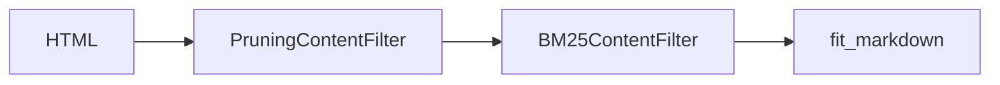

# Crawl4AI 網頁內容清理自動化

> 減少人工審核 `exclude_words` 的負擔，分三層逐步加強自動化
>
> **分析完成（2026-09-16）**：三層方案均不採用，維持現有架構。詳見結論。

## 現狀分析

### 已實作的清理策略

對照 `website_crawler.py` 與 `docs/survey/phase1/crawl4ai_website_clean.md`，目前專案已實作：

| 層級 | 策略 | 實作位置 | 狀態 |
|------|------|---------|------|
| crawl4ai 層 | `PruningContentFilter(threshold=0.25)` | `website_crawler.py → _crawl_website_async()` | ✅ 已啟用，但閾值較寬鬆 |
| Markdown 清洗層 | `exclude_words` 逐行過濾 | `markdown_cleaner.py → clean_markdown()` | ✅ 已啟用，但依賴人工維護 |
| Markdown 清洗層 | 空錨點連結移除 | `markdown_cleaner.py` | ✅ 已實作 |
| Markdown 清洗層 | 空列表雜訊移除 | `markdown_cleaner.py` | ✅ 已實作 |
| Markdown 清洗層 | 空標題列提升 | `markdown_cleaner.py` | ✅ 已實作 |
| URL 過濾層 | `URLPatternFilter` + `DomainFilter` | `website_crawler.py → _crawl_website_async()` | ✅ 已啟用（決定爬取範圍，非內容清理） |

### 核心痛點

`exclude_words` 是目前唯一能處理「出現在正確 DOM 區塊中的雜訊文字」的手段（例如正文區塊內的分類標籤 `焦點新聞`、`[ 更多 ]`）。每新增一個網站，都需要人工審視爬取結果，逐一識別雜訊並加入設定檔。

### 已實作 vs survey 建議的差距

| Survey 方案 | 狀態 |
|------------|------|
| PruningContentFilter 基本啟用 | ✅ 已實作（`threshold=0.25`） |
| PruningContentFilter 加入 `min_word_threshold` | ⛔ 已測試，不採用（見結論） |
| PruningContentFilter `threshold_type="dynamic"` | ✅ 已實作（2026-09-16） |
| BM25ContentFilter（查詢相關性過濾） | ⛔ 不採用（見結論） |
| LLMContentFilter（LLM 語義過濾） | ❌ 未實作 |
| 兩階段過濾（Pruning + BM25） | ⛔ 不採用（見結論） |

---

## 第一層：調整 PruningContentFilter 參數（零代碼改動）

### 目標

在不改變架構的前提下，透過調參提升自動過濾效果。

### 改動點

`website_crawler.py → _crawl_website_async()`：

```python
# 目前
pruning_content_filter = PruningContentFilter(
    threshold=self.content_threshold,  # 0.25
)

# 改為
pruning_content_filter = PruningContentFilter(
    threshold=self.content_threshold,
    min_word_threshold=10,  # 新增：低於 10 字的區塊直接移除
)
```

`website_crawler_config.py` 新增欄位：

```python
@dataclass
class WebsiteCrawlerConfig(BaseModuleConfig):
    ...
    content_threshold: float = KEEP_IMAGE_CONTENT_THRESHOLD
    min_word_threshold: int = 10  # 新增
    ...
```

`configs/website_crawler/default.toml` 對應更新：

```toml
[init]
content_threshold = 0.25
min_word_threshold = 10  # 新增
```

### 預期效果

- 移除短文本雜訊（如 `更多`、`前一頁`、`第一頁` 等 2~5 字的導覽元素）
- 不影響主要內容（正文段落通常遠超 10 字）
- 零成本、零風險

### 驗證方式

用 `nculab` 和 `ncucsie` 各爬取一次，比較 `min_word_threshold=10` 前後的 `fit_markdown` 差異。

---

## 第二層：探索 `threshold_type="dynamic"` 動態閾值

### 目標

讓 PruningContentFilter 根據頁面內容自動調整閾值，對不同佈局的頁面更彈性。

### 改動點

`website_crawler.py → _crawl_website_async()`：

```python
pruning_content_filter = PruningContentFilter(
    threshold=self.content_threshold,
    threshold_type="dynamic",  # 從 "fixed" 改為 "dynamic"
    min_word_threshold=10,
)
```

`website_crawler_config.py` 新增欄位：

```python
threshold_type: str = "fixed"  # "fixed" 或 "dynamic"
```

### 動態閾值的行為

- `"fixed"`：所有頁面使用相同的 threshold（目前行為）
- `"dynamic"`：根據頁面的文字密度分佈自動計算閾值，對文字密度差異大的頁面更有效

### 預期效果

- 對不同佈局的頁面（如 Google Sites vs 原生 HTML）自動適應
- 減少因 `threshold` 過高或過低導致的內容遺漏或雜訊殘留

### 驗證方式

分別以 `"fixed"` 和 `"dynamic"` 模式爬取同一網站，比較 `fit_markdown` 的內容保留率與雜訊殘留率。

---

## 第三層：加入 BM25 作為可選的二次過濾

### 目標

在 Pruning 之後，用 BM25 根據查詢相關性進一步過濾，保留與網站主題更相關的內容。

### 架構設計



Pruning 負責移除明顯的 DOM 雜訊（導覽列、頁尾），BM25 負責保留與主題相關的內容區塊。兩者串接可大幅減少 `exclude_words` 的需求。

### 改動點

#### 1. 設定檔新增 BM25 參數

`configs/website_crawler/default.toml`：

```toml
[init]
content_threshold = 0.25
min_word_threshold = 10
threshold_type = "fixed"

[bm25]
# 為 None 則不啟用 BM25 二次過濾
user_query = "實驗室 研究 成員 課程"
bm25_threshold = 0.3
use_stemming = true
language = "english"
```

#### 2. Config 新增 BM25 欄位

`website_crawler_config.py`：

```python
INIT_KEYS = {
    "site_id",
    "max_depth",
    "max_pages",
    "content_threshold",
    "min_word_threshold",      # 新增
    "threshold_type",          # 新增
    "light_mode",
    "wait_for_images",
}

# 新增 BM25 section
DEFAULT_BM25_CONFIG_SECTION = "bm25"
BM25_KEYS = {
    "bm25_user_query",
    "bm25_threshold",
    "bm25_use_stemming",
    "bm25_language",
}

SECTIONS_TO_KEYS = {
    DEFAULT_INIT_CONFIG_SECTION: INIT_KEYS,
    DEFAULT_CRAWL_CONFIG_SECTION: CRAWL_KEYS,
    DEFAULT_BM25_CONFIG_SECTION: BM25_KEYS,  # 新增
}
```

#### 3. WebsiteCrawler 新增 BM25 參數

```python
class WebsiteCrawler:
    def __init__(
        self,
        max_depth: int | None = None,
        max_pages: int | None = None,
        content_threshold: float = KEEP_IMAGE_CONTENT_THRESHOLD,
        min_word_threshold: int = 10,
        threshold_type: str = "fixed",
        light_mode: bool = True,
        wait_for_images: bool = True,
        # BM25 參數
        bm25_user_query: str | None = None,
        bm25_threshold: float = 0.3,
        bm25_use_stemming: bool = True,
        bm25_language: str = "english",
    ) -> None:
        ...
        self.bm25_user_query = bm25_user_query
        self.bm25_threshold = bm25_threshold
        self.bm25_use_stemming = bm25_use_stemming
        self.bm25_language = bm25_language
```

#### 4. `_crawl_website_async()` 加入 BM25 二次過濾

```python
async def _crawl_website_async(self) -> list:
    browser_config = BrowserConfig()

    # 第一階段：PruningContentFilter
    pruning_content_filter = PruningContentFilter(
        threshold=self.content_threshold,
        min_word_threshold=self.min_word_threshold,
        threshold_type=self.threshold_type,
    )

    # 第二階段：BM25ContentFilter（可選）
    bm25_content_filter = None
    if self.bm25_user_query:
        from crawl4ai.content_filter_strategy import BM25ContentFilter
        bm25_content_filter = BM25ContentFilter(
            user_query=self.bm25_user_query,
            bm25_threshold=self.bm25_threshold,
            use_stemming=self.bm25_use_stemming,
            language=self.bm25_language,
        )

    filters: list[URLFilter] = []
    if self.url_patterns is not None:
        filters.append(URLPatternFilter(patterns=self.url_patterns))
    if self.allowed_domains is not None:
        filters.append(DomainFilter(allowed_domains=self.allowed_domains))
    filter_chain = FilterChain(filters)

    strategy_kwargs: dict[str, Any] = {"filter_chain": filter_chain}
    if self.max_depth is not None:
        strategy_kwargs["max_depth"] = self.max_depth
    if self.max_pages is not None:
        strategy_kwargs["max_pages"] = self.max_pages
    bfs_strategy = BFSDeepCrawlStrategy(**strategy_kwargs)

    # Pruning 作為 primary filter
    crawler_run_config = CrawlerRunConfig(
        markdown_generator=DefaultMarkdownGenerator(
            content_filter=pruning_content_filter,
        ),
        deep_crawl_strategy=bfs_strategy,
        wait_for_images=self.wait_for_images,
    )

    async with AsyncWebCrawler(config=browser_config) as crawler:
        results = await crawler.arun(self.url, crawler_run_config)

    # BM25 二次過濾（在 crawl4ai 結果上）
    if bm25_content_filter and results:
        for result in results:
            if result.markdown and result.markdown.fit_markdown:
                pruned_chunks = bm25_content_filter.filter_content(
                    result.markdown.fit_markdown
                )
                result.markdown.fit_markdown = "\n---\n".join(pruned_chunks)

    if not isinstance(results, list):
        results = [results] if results else []

    return results
```

#### 5. CLI 支援 BM25 參數覆寫

`workflow_config.py`：

```python
@dataclass
class WebsiteCrawlerModuleConfig:
    max_pages: int | None = None
    bm25_user_query: str | None = None   # 新增
    bm25_threshold: float | None = None  # 新增
```

### 預期效果

- Pruning 先移除 DOM 雜訊（導覽列、頁尾），BM25 再保留與主題相關的內容區塊
- `exclude_words` 可大幅精簡（僅保留正文區塊內的特定雜訊）
- 新網站只需設定 `user_query`，不需逐一識別雜訊文字

### 驗證方式

以 `nculab` 為例：
1. 仅用 Pruning 爬取 → 記錄 `fit_markdown` 結果
2. Pruning + BM25（`user_query="實驗室 成員 研究"`）爬取 → 比較結果
3. 確認 BM25 未誤刪主要內容（成員介紹、研究方向等）

---

## 實作優先順序

| 順序 | 層級 | 改動量 | 風險 | 預期收益 | 結論 |
|------|------|--------|------|---------|------|
| 1 | 第一層：`min_word_threshold` | 小（~10 行） | 低 | 移除短文本雜訊 | ⛔ 不採用 |
| 2 | 第二層：`threshold_type="dynamic"` | 小（~5 行） | 低 | 自動適應不同佈局 | ⛔ 不採用 |
| 3 | 第三層：BM25 二次過濾 | 中（~60 行） | 中 | 大幅減少 exclude_words | ⛔ 不採用 |

建議先完成第一層，驗證效果後再依序推進。

---

## 結論（2026-09-16）

### 總結

三層自動化方案均不採用，維持現有架構。核心原因：

| 層級 | 不採用原因 |
|------|-----------|
| `min_word_threshold` | Google Sites 將內容包裹在大量小型 DOM 容器中，導致有意義內容被整體移除（-52%） |
| `threshold_type="dynamic"` | 對超連結施加更嚴格過濾，導致研究論文 PDF、資料集下載等有價值連結被移除 |
| BM25 二次過濾 | 區塊級過濾無法精確解決行級雜訊問題；配置複雜度增加但收益不明確 |

**建議後續方向**：改進 `clean_markdown()` 的行級過濾邏輯，而非在 crawl4ai 層級增加複雜度。

### 第一層 `min_word_threshold`：⛔ 不採用

以 nculab 站點執行 A/B 比較測試（`runs/20260916_171949/ab_test_min_word_threshold/`），結果：

| 指標 | 結果 |
|------|------|
| 總行數變化 | 1434 → 692（**-52%**） |
| 短文本雜訊移除 | 60 行 ✅ 有效 |
| 主要內容被移除 | 872 行 ❌ 嚴重退化 |
| 頁面完全空白 | 8 頁（members、labintro 等） |

**根因**：`min_word_threshold` 在 HTML 區塊層級運作，Google Sites 將內容包裹在大量小型 DOM 容器中（每個清單項目、標題、圖片各為獨立區塊），導致字數不足的有意義內容被整體移除。

**決策**：保持 `min_word_threshold=None`（不啟用）。現有 `exclude_words` 已有效處理導覽雜訊，此參數的額外收益有限但風險過高。代碼已回復。

### 第二層 `threshold_type="dynamic"`：⛔ 不採用（nculab 站點）

以 nculab 站點執行 A/B 比較測試（`runs/20260916_224803/ab_test_dynamic_threshold/`），結果：

| 指標 | Fixed | Dynamic | Δ |
|------|-------|---------|---|
| 頁面數 | 52 | 52 | 0 |
| 總 fit_markdown 字元 | 247,338 | 246,287 | -0.42% |
| 平均字元/頁 | 4,756.5 | 4,736.3 | -0.42% |
| 執行時間 | 23.3s | 22.4s | -8.5% |

**差異頁面分析**（18/52 頁有差異，5 頁差異顯著）：

| 頁面 | 差異 | 移除內容 | 嚴重度 |
|------|------|---------|--------|
| projects_WDEMS_unsupervisedpage-levelwrapperinduction | -398 chars (-16.4%) | PDF 連結 + 影片展示 | HIGH |
| projects_WDEMS_plde | -230 chars (-9.4%) | PDF 連結 | HIGH |
| projects_powerpoi | -152 chars (-2.8%) | 期刊連結 | MEDIUM |
| members_activities | -145 chars (-3.0%) | Flickr 相簿連結 | LOW |
| projects_powerpoi_mapmarker... | -125 chars (-5.9%) | 資料集下載連結 | HIGH |

**根因**：動態閾值模式在 `PruningContentFilter` 內部對超連結（`<a>` 標籤的 `href`）施加更嚴格的過濾，導致研究論文 PDF、資料集下載、展示影片等有價值的連結被移除，但周圍文字保留。對於研究實驗室網站，這些連結是最有價值的內容。

**決策**：保持 `threshold_type="fixed"`（預設值）。動態閾值在 nculab 站點上會丟失重要研究資源連結，不適合直接採用。代碼已保留 `threshold_type` 參數（可透過 CLI 覆寫），但預設值維持 `"fixed"`。

### 第三層 BM25 二次過濾：⛔ 不採用

**分析**：

| 面向 | `exclude_words` | BM25 |
|------|----------------|------|
| 過濾粒度 | 行級（逐行匹配） | 區塊級（chunk） |
| 判斷依據 | 關鍵字存在與否 | 查詢相關性評分 |
| 設定負擔 | 每站需人工識別雜訊 | 需設定 `user_query` |
| 適用場景 | 已知的特定雜訊文字 | 未知的不相關內容 |

**根因**：BM25 是區塊級過濾，無法精確解決行級雜訊問題。核心痛點（Google Sites 行級雜訊）與 BM25 的解決方案不完全重疊。

**決策**：不實作 BM25。核心痛點是行級雜訊，BM25 的區塊級過濾無法精確解決；配置複雜度增加但收益不明確。建議改進 `clean_markdown()` 的行級過濾邏輯。

### 後續方向

- **後處理替代方案**：若需行級短文本過濾，可在 `clean_markdown()` 中實作（HTML 區塊級別不適合）
- **動態閾值改良**：若 crawl4ai 後續版本修正超連結移除問題，可重新評估 `threshold_type="dynamic"`

---

## 相關文件

- `docs/survey/phase1/crawl4ai_website_clean.md` — crawl4ai 三種過濾方案的詳細說明（已移除，內容整合至本文件）
- `src/app/engines/website_crawler.py` — 爬蟲引擎（主要改動位置）
- `src/app/configs/website_crawler_config.py` — 爬蟲設定（需新增欄位）
- `src/utils/markdown_cleaner.py` — Markdown 清洗（現有 `exclude_words` 邏輯）
- `configs/website_crawler/*.toml` — 各站點設定檔
