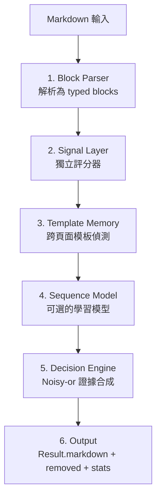
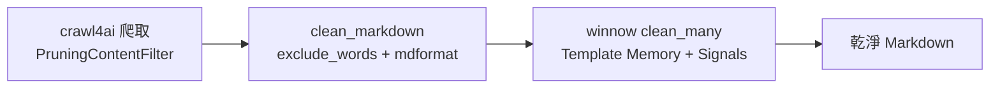

# winnow-md：加強 clean_markdown 的方案調查

> 調查是否有現成工具可用於清理從網頁爬蟲得來的 Markdown，減少人工 `exclude_words` 的負擔

## 調查背景

目前 `src/utils/markdown_cleaner.py` 的 `clean_markdown()` 負責 Markdown 後處理，但核心的雜訊移除完全依賴 `exclude_words` 逐行比對——需要人工審視爬取結果，逐一識別雜訊並加入設定檔。

**調查問題：** 是否有現成的 Python 套件，專門清理「已轉換為 Markdown 的爬取結果」？

---

## 調查結果總覽

| 工具 | 工作層級 | 類型 | 支援清理已轉換的 Markdown？ | 成本 |
|------|---------|------|--------------------------|------|
| **winnow-md** | Markdown 層級 | 雜訊區塊移除 | ✅ **專門為此設計** | 免費 |
| **mdformat** | Markdown 層級 | 格式化 | ❌ 只改格式，不刪內容 | 免費 |
| crawl4ai options | Markdown 轉換階段 | 選項配置 | ⚠️ 在轉換時生效，非後處理 | 免費 |
| Trafilatura | HTML 層級 | 主內容提取 | ❌ 在 HTML 階段工作 | 免費 |
| Readability-lxml | HTML 層級 | 主內容提取 | ❌ 在 HTML 階段工作 | 免費 |

**結論：** `winnow-md` 是目前唯一專門針對「已轉換為 Markdown 的爬取結果」進行雜訊清理的 Python 套件。

---

## winnow-md 詳細介紹

### 基本資訊

| 項目 | 內容 |
|------|------|
| PyPI | `pip install winnow-md` |
| GitHub | [Isa1asN/winnow-md](https://github.com/Isa1asN/winnow-md) |
| 版本 | v0.1.0（2026-07 發布） |
| 授權 | MIT |
| Python | 3.9+ |
| 依賴 | 核心零依賴；可選 `[model]`（numpy + model2vec）、`[tokens]`（tiktoken） |
| 定位 | 專門清理「已轉換為 Markdown 的爬取結果」— 在 HTML→Markdown 轉換**之後**工作 |

### 核心設計哲學

Winnow 的核心假設：**雜訊是多餘的（boilerplate is redundancy）**，出現在三個軸上：

1. **跨頁面重複**（Template Memory）— 同一網站多個頁面都出現的區塊 = 模板雜訊
2. **全網通用**（Signals + Learned Scorer）— 導覽列、Cookie 同意、頁尾等通用雜訊模式
3. **與任務無關**（Future: Focus Mode）— 將來可擴展

**三條鐵律：**

| 鐵律 | 說明 |
|------|------|
| **Subtractive only** | 只刪除區塊，不改寫任何文字。零幻覺風險 |
| **Recall first** | 刪除內容 = 靜默資料遺失；保留雜訊 = 多花 token。不確定時保留 |
| **Auditable** | 每個被刪除的區塊都有原因代碼，可完全追溯 |

### 效能基準

| aggressiveness | 閾值 | 內容保留率 | 雜訊移除率 | Token 減少 |
|---------------|------|-----------|-----------|-----------|
| 0.00（最安全） | 0.85 | 99.75% | 99.1% | −30% |
| 0.25 | 0.74 | 99.29% | 98.7% | −36% |
| **0.50（預設）** | **0.625** | **99.28%** | **98.4%** | **−36%** |
| 0.75 | 0.51 | 99.26% | 98.3% | −37% |
| 1.00（最激進） | 0.40 | 96.28% | 96.0% | −40% |

---

## Pipeline 架構



### 1. Block Parser (`winnow/parse.py`)

將 Markdown 按行解析為 typed blocks：`paragraph`、`heading`、`list`、`code`、`table`、`quote`、`image`、`hr`。

每個 block 搭載特徵向量：link_density、plain_length、position、section_path、list_link_fraction、digit_ratio。

### 2. Signal Layer (`winnow/signals/`)

獨立評分器，發出 `Evidence(block_index, weight, reason)`。**任何單一 signal 都不能刪除區塊。**

| Signal | 原因代碼 | 說明 |
|--------|---------|------|
| Lexicon | `COOKIE_CONSENT`, `PROMO_SUBSCRIBE`, `ACCOUNT_PROMPT`, `SOCIAL_SHARE`, `LEGAL_FOOTER`, `NAV_CHROME`, `ADVERT` | 詞典模式匹配（內建多語言詞典） |
| Nav List | `NAV_LINK_LIST` | 連結列表（導覽列特徵） |
| Link Heavy | `LINK_HEAVY` | 連結密度極高的區塊 |
| Encoded Blob | `ENCODED_BLOB` | base64 殘留、srcset 殘留 |
| Syntax Row | `SYNTAX_ROW` | 空白表格行 |
| Citation List | `CITATION_LIST` | 引用列表 |
| Positional | `HEAD_CHROME`, `FOOTER_ZONE`, `PAGE_CHROME` | 位置位於頁首/頁尾 |
| Template | `TEMPLATE_REPEAT` | 跨頁面重複出現的區塊 |
| Model | `MODEL` | 學習模型評分（可選） |

### 3. Template Memory (`winnow/template.py`)

跨頁面學習網站模板：**同一域名 ≥3 頁面中 ≥75% 出現的區塊 → 判定為模板雜訊。**

技術實現：
- simhash64（BLAKE2b + 64-bit fingerprint）
- Jaccard 相似度偵測 URL 變體/翻譯重複
- Code blocks 和小型 tables 永遠不被 template evidence 影響

持久化模式：
- `MemoryTemplateStore`（預設）：記憶體，適合批次處理
- `SQLiteTemplateStore`（`store="winnow.db"`）：SQLite，適合串流/增量處理

### 4. Decision Engine (`winnow/decide.py`)

Noisy-or 證據合成 + recall-first 保護機制：

```python
threshold = 0.85 - 0.45 * aggressiveness
# aggressiveness=0.0 → threshold=0.85（最安全）
# aggressiveness=0.5 → threshold=0.625（預設）
# aggressiveness=1.0 → threshold=0.40（最激進）
```

### 5. Output (`winnow/report.py`)

| 屬性/方法 | 說明 |
|-----------|------|
| `result.markdown` | 清理後的 Markdown |
| `result.removed` | 被移除區塊的收據（`RemovedBlock` 列表） |
| `result.stats` | token 統計 |
| `result.integrity()` | 資訊遺失審計（遺失的 tables/links/images/words） |

---

## API 使用方式

### 單頁清理

```python
import winnow

res = winnow.clean(markdown_text)
print(res.markdown)          # 清理後的 Markdown
print(res.stats)             # {'tokens_before': 1200, 'tokens_after': 780, 'reduction_pct': 35.0, ...}

for r in res.removed:
    print(f"[{r.reasons}] {r.text[:80]}")

print(res.integrity())
# {'tables_lost': [], 'links_lost': [...], 'words_total': 850, 'words_lost': 3, ...}
```

### 批次清理（Template Memory 啟用）

```python
w = winnow.Winnow(aggressiveness=0.5)

pages = [
    (page1_md, "https://example.com/page1"),
    (page2_md, "https://example.com/page2"),
    (page3_md, "https://example.com/page3"),
]

results = w.clean_many(pages)
# Template Memory 自動學習：導覽列在 3 頁都出現 → 判定為模板 → 全部移除
```

### CLI

```bash
winnow clean page.md                      # 單檔清理
winnow clean ./crawl/ --report out.html   # 批次 + HTML 審計報告
winnow clean ./crawl/ --url-mode strip    # 去除連結中的 URL（額外 ~15% token 減少）
winnow clean ./crawl/ -a 0.7              # 自訂激進程度
```

---

## 與專案 clean_markdown 的整合分析

### 目前 clean_markdown 的能力

`clean_markdown()` 位於 `src/utils/markdown_cleaner.py`，提供六項清理功能：

1. `exclude_words` 逐行過濾（需人工維護）
2. 空錨點連結移除
3. 空列表雜訊移除
4. 空標題列提升
5. mdformat 格式化
6. 圖片間距修復

### winnow-md 補足的能力

| clean_markdown 能力 | winnow-md 能力 | 互補關係 |
|-------------------|---------------|---------|
| `exclude_words` 逐行過濾 | Template Memory 跨頁面模板偵測 | winnow 自動學到哪些是模板 → `exclude_words` 可大幅精簡 |
| 空錨點/空列表清理 | Lexicon 詞典匹配（Cookie、導覽、頁尾等） | winnow 處理結構性雜訊，clean_markdown 處理格式異常 |
| mdformat 格式化 | — | 互不衝突，可同時使用 |

### 整合流程



三階段串接：crawl4ai 在 HTML 層級移除 DOM 雜訊 → clean_markdown 以 `exclude_words` 和格式化做 Markdown 層級的精細清理 → winnow 以 Template Memory 跨頁面自動移除殘留的模板雜訊。

### 清理方式選擇：clean_many() 批次模式

winnow-md 提供兩種清理方式：

| 面向 | `clean()` 單頁模式 | `clean_many()` 批次模式 |
|------|-------------------|----------------------|
| Template Memory | 冷啟動，無跨頁面知識 | 跨頁面自動學習模板 |
| 處理方式 | 每頁獨立清理 | 先 fingerprint 所有頁面，再清理 |
| 適用場景 | 單一頁面、無上下文 | 同一網站的多個頁面 |

**`clean_many()` 批次模式更適合本專案**，原因如下：

1. **Template Memory 命中使用情境** — 目標網站（如 nculab、ncucsie）是同一網站的多個頁面，共享相同的導覽列、頁尾等模板。`clean_many()` 會自動偵測跨頁面重複的區塊並移除，這正是 `exclude_words` 目前在做的事。
2. **所有頁面已在記憶體中** — `WebsiteCrawler._filter_crawl_results()` 收到的 `crawl_results` 是完整 list，不需要額外收集。直接將整個 list 送給 `clean_many()` 即可，不需要改動資料流。
3. **只需建立一次 Winnow 實例** — 批次模式下 `Winnow` 實例在整個爬取過程中保持活著，Template Memory 持續累積。單頁模式則是每頁獨立，無法跨頁面學習。

若使用 `clean()` 逐頁呼叫，等於放棄了 Template Memory——這是選擇 winnow-md 的主要理由之一。`clean()` 適合的場景是「只有一個頁面、無法收集多頁」，但本專案的爬蟲已經一次收集了整個網站的所有頁面。

### 整合概念

在 `_filter_crawl_results()` 中，先以現有的 `clean_markdown()` 處理每一頁，再將所有頁面收集後以 `clean_many()` 批次清理。`clean_markdown` 的 `exclude_words` 保留作為最後一道防線，處理出現在正文區塊中的特定雜訊（如 `焦點新聞`、`[ 更多 ]`）；winnow 則處理結構性的模板雜訊（導覽列、頁尾、Cookie 同意、社群分享等）。兩者互補，`exclude_words` 可大幅精簡。

### 關鍵優勢

- `clean_markdown` 的 `exclude_words` 處理「出現在正文區塊中的特定雜訊」（如 `焦點新聞`、`[ 更多 ]`）
- `winnow` 處理「結構性的模板雜訊」（導覽列、頁尾、Cookie 同意、社群分享等）
- 兩者互補，`exclude_words` 可大幅精簡
- Template Memory 特別適合：爬取同一網站的多個頁面時，自動學到模板模式

---

## 風險與限制

| 風險 | 說明 | 緩解方式 |
|------|------|---------|
| Star 數僅 1 | 2026-07 發布，社群驗證尚少 | 先在 dev 環境驗證，保留 `exclude_words` 作為回退 |
| Content recall 99.28% | 極少數內容可能被誤刪 | `result.integrity()` 可審計；`aggressiveness=0.0` 可進一步降低風險 |
| 非確定性（Model） | 安裝 `[model]` extra 後有輕微隨機性 | 可設定 `use_model=False` 僅用 heuristics |
| 中文支援 | 詞典以英文為主 | 核心 heuristics（link_density、template memory）不依賴語言 |

---

## 參考來源

- [winnow-md GitHub](https://github.com/Isa1asN/winnow-md)
- [winnow-md PyPI](https://pypi.org/project/winnow-md/)
- [ARCHITECTURE.md](https://github.com/Isa1asN/winnow-md/blob/main/ARCHITECTURE.md)
- [ScrapingHub Article Extraction Benchmark](https://github.com/scrapinghub/article-extraction-benchmark)
- 專案現有清理邏輯：`src/utils/markdown_cleaner.py`
